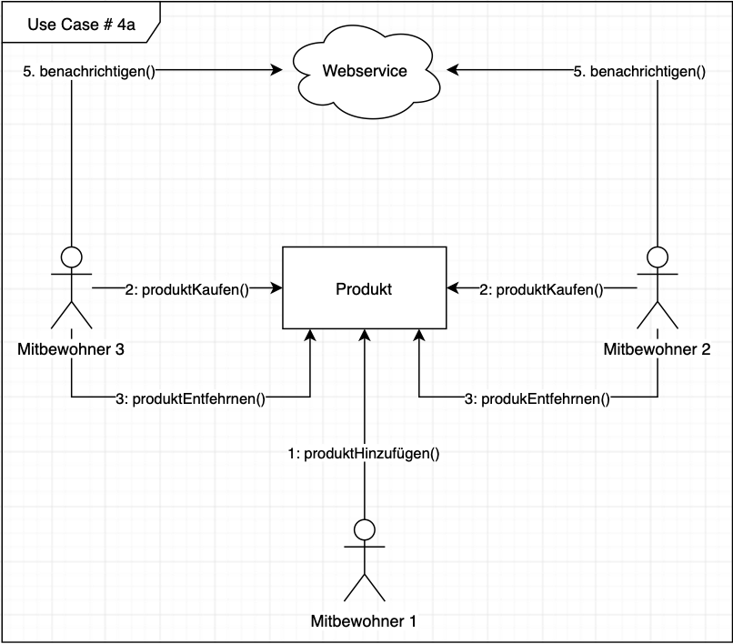
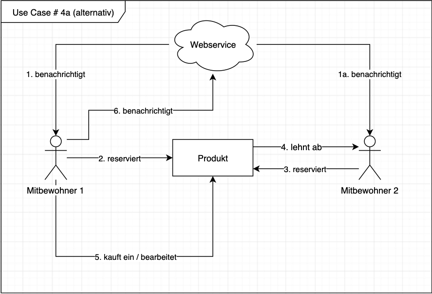

# Use Cases

Alle Use Cases befinden sich im Lösungsraum.

**Übersicht:**
- [Use Case 1: Bearbeitung der Einkaufsliste](#use-case-1-hinzufügen-von-einträgen-zur-einkaufsliste)
- [Use Case 2: Abarbeitung der Einkaufsliste](#use-case-3-entfernen-von-einträgen-in-der-einkaufsliste)
- [Use Case 3: Kostenaufteilung](#use-case-2-kostenaufteilung)
- [Use Case 4: Mitbewohner befindet sich in der Nähe eines Geschäftes](#use-case-4-mitbewohner-befindet-sich-in-der-nähe-eines-geschäftes)
- [Use Case 4a: Zwei Mitbewohner kaufen gleichzeitig ein Produkt Geschäftes](#use-case-4a-zwei-mitbewohner-kaufen-gleichzeitig-ein-produkt)

***

## Use Case 1: Hinzufügen von Einträgen zur Einkaufsliste

- **Level:** Primary Task
- **Preconditions:** Es liegt eine Einkaufsliste vor.
- **Success End Condition:** Der User hat Produkte hinzugefügt.
- **Failed End Condition:** Das Produkt konnte nicht hinzugefügt werden.
- **Primary Actor:** WG-Mitbewohner
- **Trigger:** Der User benötigt ein Produkt.

### Main Success Szenario
| #   | Beschreibung |
|:---:|--------------|
| 1.  | Der User überprüft, ob das Produkt auf der Liste steht. |

### Erweiterungen
| #   | Beschreibung |
|:---:|--------------|
| 1a. | Das Produkt befindet sich nicht auf der Liste. |
| 1a1. | Der User fügt das Produkt hinzu. |
| 1a2. | Alle anderen Mitbewohner werden benachrichtigt. |

***

## Use Case 2: Entfernen von Einträgen in der Einkaufsliste

- **Level:** Primary Task
- **Preconditions:**  Es befinden sich Produkte in der Einkaufliste.
- **Success End Condition:** Das Produkt wurde entfernt.
- **Failed End Condition:** Das nicht mehr benötigte Produkte konnte nicht entfernt werden.
- **Primary Actor:** WG-Mitbewohner
- **Trigger:** Es soll ein Produkt entfernt werden.

### Main Success Szenario
| #   | Beschreibung |
|:---:|--------------|
| 1. | Der User prüft, ob das zu entfernende Produkt noch in der Einkaufliste ist. |

### Erweiterungen
| #   | Extension |
|:---:|--------------|
| 1. | Das Produkt befindet sich in der Liste. |
| 1a1. | Das Produkt wird entfernt.  |
| 1a2. | Alle anderen Mitbewohner werden benachrichtigt. |

***

## Use Case 3: Kostenaufteilung

- **Level:** Subfunction
- **Preconditions:** Es liegen Ausgaben verschiedener Mitbewohner vor.
- **Success End Condition:** Eine faire Kostenaufteilung zwischen den Mitbewohnern wird gewährleistet.
- **Failed End Condition:** Es konnte keine faire Kostenaufteilung durchgeführt werden.
- **Primary Actor:** WG-Mitbewohner, (System)?
- **Trigger:** Es wurden Ausgaben getätigt, die gerecht aufgeteilt werden müssen.

### Main Success Szenario
| #   | Beschreibung |
|:---:|--------------|
| 1. | Es wird geprüft, ob Ausgaben in der Einkaufsliste vorliegen. |

### Erweiterungen
| #   | Extension |
|:---:|--------------|
| 1. | Es liegen Ausgaben vor. |
| 1a1. | Die Ausgaben werden gerecht berechnet.|
| 2. | Die User teilen die berechneten Ausgaben untereinander auf. |

***

## Use Case 4: Mitbewohner wird über Einkaufsmöglichkeit benachrichtigt

- **Level:** Primary Task
- **Preconditions:** Es existiert eine Einkaufsliste mit mind. einem Element.
- **Success End Condition:** Der User wir benachrichtigt.
- **Failed End Condition:** Der User erhält keine Benachrichtigung.
- **Primary Actor:** System
- **Trigger:** Der User befindet sich in der Nähe eines Geschäfts, in dem ein Element erwerbar ist.

### Main Success Szenario
| #   | Beschreibung |
|:---:|--------------|
| 1. | Der User wird über Verfügbarkeit benachrichtigt. |
| 2. | Der User bemerkt die Benachrichtigung. |

### Erweiterungen
| #   | Extension |
|:---:|--------------|
| 2a. | Der User entscheidet sich, das Produkt zu kaufen. |

***

## Use Case 4a: Zwei Mitbewohner kaufen gleichzeitig ein Produkt

- **Level:** Primary task
- **Preconditions:** Es existiert eine Einkaufsliste mit mind. einem Element.
- **Success End Condition:** Produkt wurde reserviert und nur einmal gekauft.
- **Failed End Condition:** Produkt wurde zweimal gekauft.
- **Primary Actor:** Mitbewohner
- **Trigger:** Zwei Mitbewohner wollen das gleiche Produkt kaufen.

[](UC_4a.pdf)
  
### Alternatives Use Case (Lösung des Doppelten-Einkaufs-Problem)
[](UC_4a-alt.pdf)

***

## Use Case 5: Vorschlagen nahe liegender Einkaufsmöglichkeiten und jeweiliger Routen

- **Level:** Primary Task
- **Preconditions:** Es existiert eine Einkaufsliste mit mind. einem Element.
- **Success End Condition:** Dem User werden alle Einkaufsmöglichkeiten in seiner Nähe mit einer berechneten Route angezeigt.
- **Failed End Condition:** Der User erhält keine Benachrichtigung.
- **Primary Actor:** System
- **Trigger:** Der User möchte ein Produkt erwerben.

### Main Success Szenario
| #   | Beschreibung |
|:---:|--------------|
| 1. | Der User wird über Einkaufsmöglichkeiten benachrichtigt. |
| 2. | Dem User wird eine Route vorgeschlagen. |
| 3. | Der User bemerkt die Benachrichtigung. |

### Erweiterungen
| #   | Extension |
|:---:|--------------|
| 2a. | Der User entscheidet sich, das Produkt zu kaufen. |


**Template (nach Cockburn):**

```
## Use Case <#>: <the name is the goal as a short active verb phrase>

- **Goal in Context:** <a longer statement of the goal in context if needed>
- **Scope:** <what system is being considered black box under design>
- **Level:** <one of: Summary, Primary task, Subfunction>
- **Preconditions:** <what we expect is already the state of the world>
- **Success End Condition:** <the state of the world upon successful completion>
- **Failed End Condition:** <the state of the world if goal abandoned>
- **Primary Actor:** <a role name for the primary actor, or description>
- **Trigger:** <the action upon the system that starts the use case, may be time event>

### Main Success Szenario
<put here the steps of the scenario from trigger to goal delivery, and any cleanup after>
| #   | Beschreibung |
|:---:|--------------|
| <step #> | <action description> |
| <step #> | <action description> |

### Erweiterungen
<put here there extensions, one at a time, each refering to the step of the main scenario>
| #   | Extension |
|:---:|--------------|
| <step #> | <action description> |
| <step #> | <action description> |

### Sub-Variationen
<put here the sub-variations that will cause eventual bifurcation in the scenario>
| #   | Variationen |
|:---:|--------------|
| <step #> | <list of sub-variations> |
| <step #> | <list of sub-variations> |

***

```
